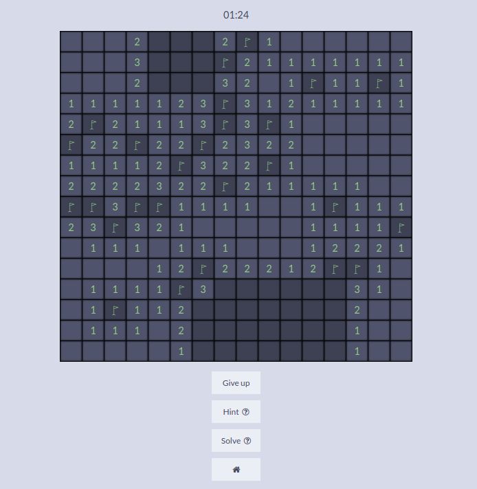

# minesweeper

https://mine-sweeper-js.herokuapp.com/

A minesweeper game with default and custom difficulty levels.

Has a hint button that reveals a non-mine square with at least one mine surrounding it.

Has a solve button that reveals non-mine squares or flags mines by checking in one pass from right to left, top to bottom.



To run locally:

```$ git clone https://github.com/rileythomp/minesweeper.git```

```$ cd minesweeper```

```$ npm i```

```$ npm start```

Then go to localhost:3000 in a browser.
